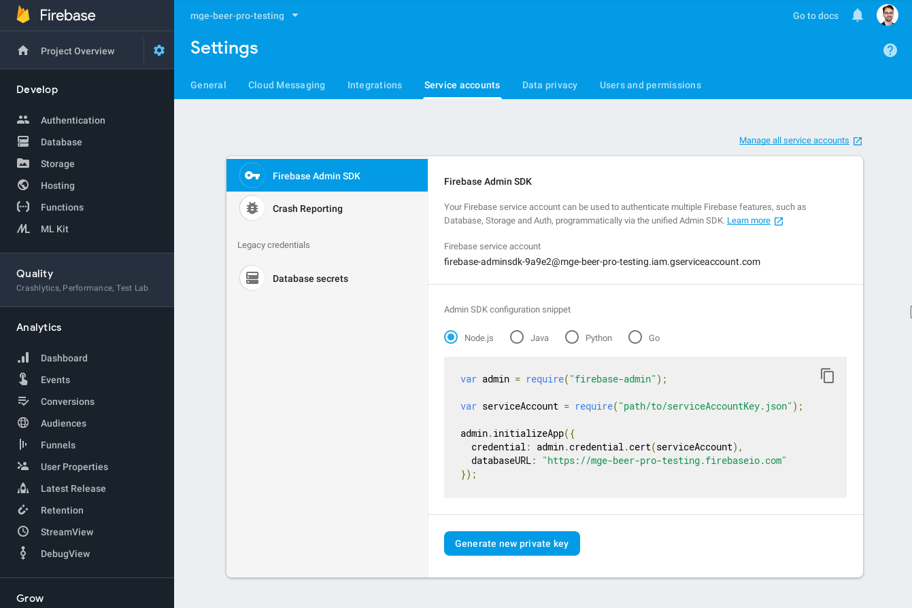

## Setup

Vor der erstem Verwendung der Scripts müssen die nötigen NPM Libraries installiert werden:

```
npm install
```

Um den Scripts Zugang zu Ihrem Google-Account zu geben benötigen Sie einen Service-Account Key, den Sie sich wie folgt herunterladen können ("Generate new private key"):



Die Datei speichern Sie in diesem Ordner in der service-key.json Datei ab.

## Import

Nun sind Sie bereit die Daten zu importieren.

```
node convert-ratebeer-csv-to-json.js locher.csv "Locher Appenzeller Bier" > data.json

node import-data.js

node convert-ratebeer-csv-to-json.js schuetzengarten.csv "Schützengarten" > data.json

node import-data.js

node convert-ratebeer-csv-to-json.js kornhausbraeu.csv "Kornhausbräu" > data.json

node import-data.js

```

Wie Sie erkennen können stammen die Daten von der Webseite Ratebeer, welche  im CSV Format vorliegen. Diese werden nach JSON umgewandelt und dann in den Firestore importiert.